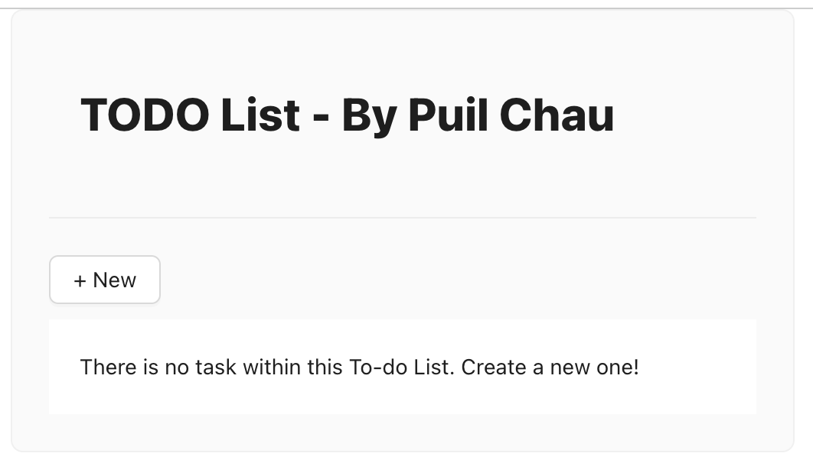
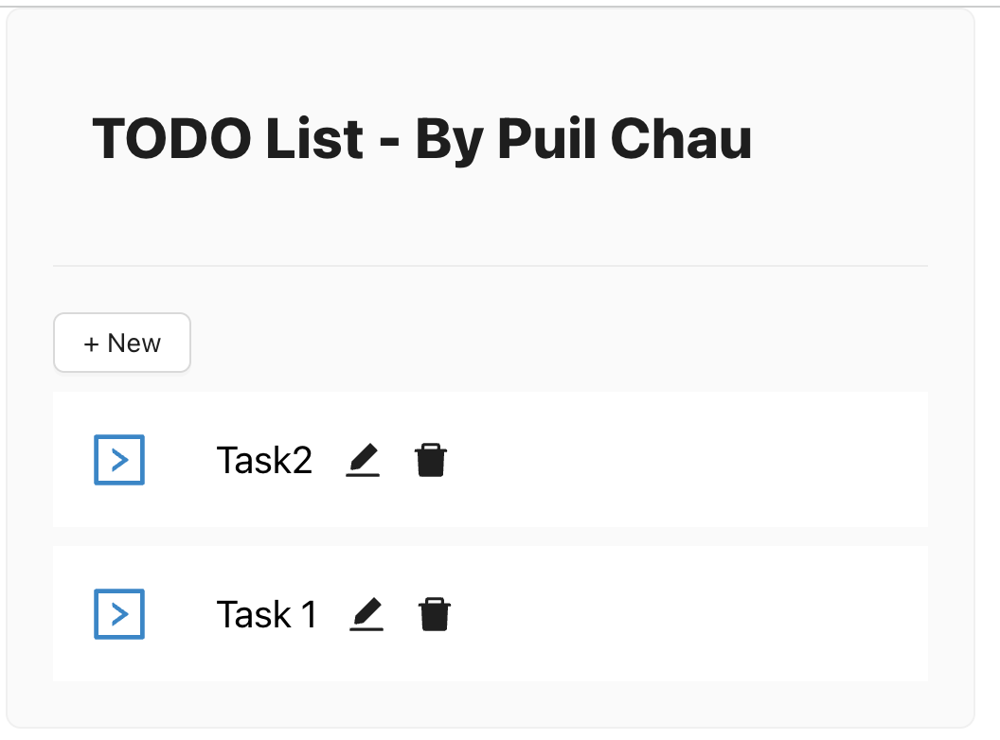
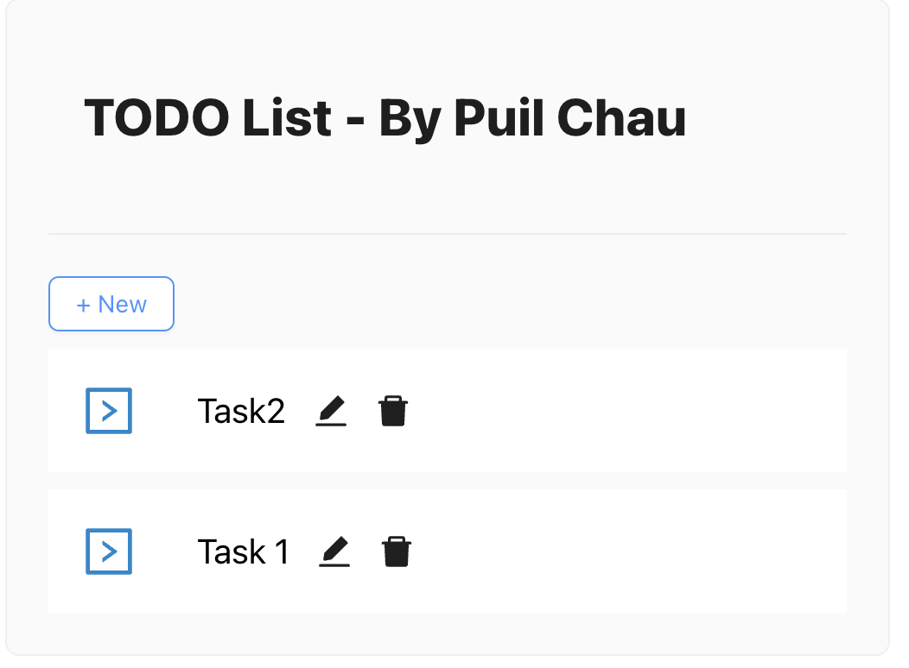
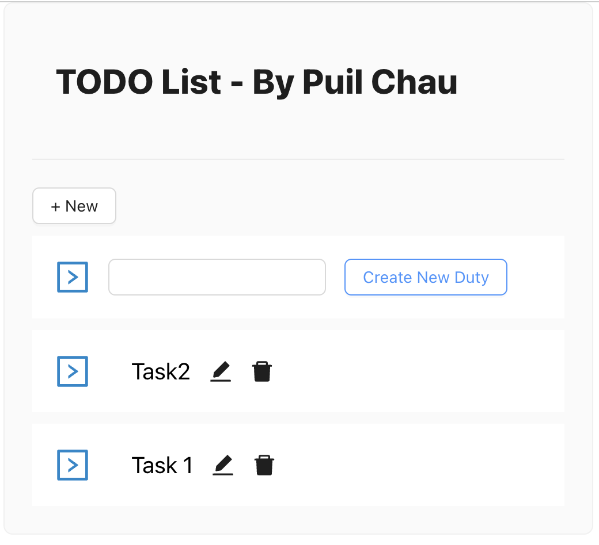
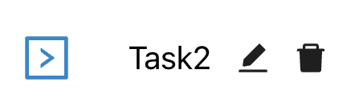
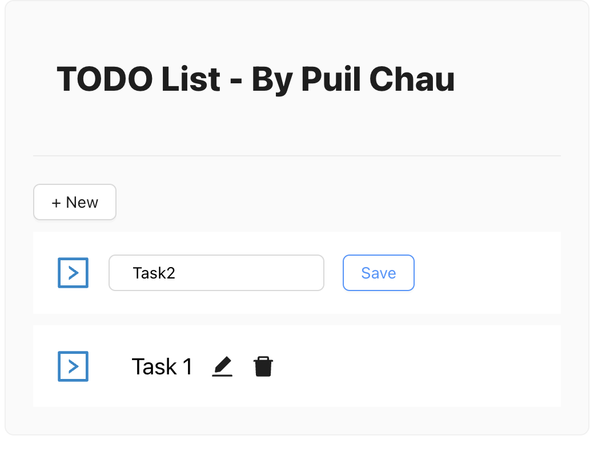
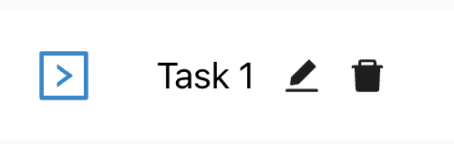

This is the Todo List Web Application by Chris Puil Chau.

This is a fully functional deployment with a linked DB which storing the duty user creating on the UI , handling from the react frontend to the node.js backend.

** Below are the documentation about UI operation for this Todo List. **
UI Operation will be divided into 4 main parts:
1. Landing (Read)
2. Create
3. Update
4. Delete

1. ** Landing **
First of all, as this todo list already deployed onto AWS, you can play with this Todo List by going to the link below:
https://www.todolist.homes/

- Without Duty
When there is without any duty storing within the DB, the below screen will be shown and noticing user for creating new duty.

- Listing Duty (Read)
When there are duty created & storing within the DB, duties will be listed like the screen below.

2. ** Create **
User can create new duties by clicking the "+ New" button on the top left of the duty list below the title.

After clicking the "+ New" button,a new duty row will pop out at the top of the duty list. User can simply input the duty name within the input field at the top row , then click "Create New Duty" button.The new created duty will be showing right at the top of the duty list.

3. ** Edit **
User can edit the target duty by clicking the edit icon right next to the duty name within the same row.

Input field will be there for user to edit the target duty name. User can save their edited duty by clicking the "Save button" on the right of the row. Then the new edited duty name will be saved and showing opn the list.

4. ** Delete **
User can delete any duty they would not keeping by clicking the bin icon right next to the edit icon on every duty row. The updated duty list will be loaded and shown right after clicking the delete icon by user.

That's All!

** Below are the documentation about cloning this and running in LOCAL ENV. **

Clone this repository if you would like to have a try locally, you can follow the steps below in order to get the frontend part running.

1. After cloning from the repository, simply go into the new folder named "TodoList".

2. As yarn is used with this application, simply install all necessary  dependencies with following command : yarn install

3. According to your local environment settings, you will need to setup a ".env" file inside the "Services" folder, with below content :
    DB_NAME=yourLocalDBName
    DB_USERNAME=yourUsername
    DB_PASSWORD=yourPWD
    DB_HOST=localhost

4. After all of the above, you are ready to run this locally ! Simply run the following command: yarn start